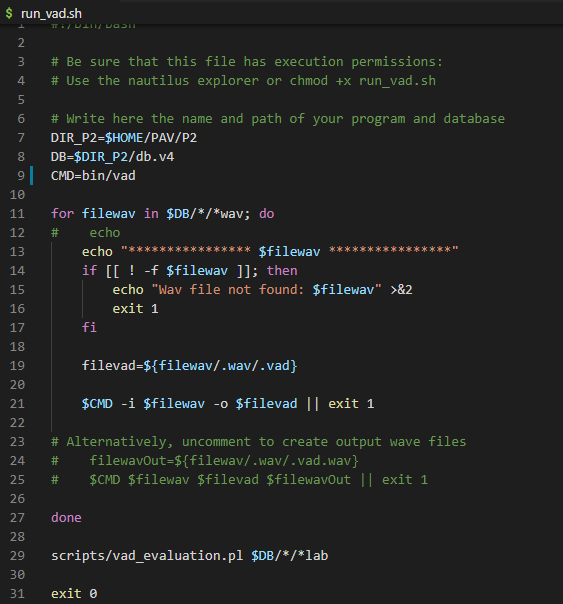

PAV - P2: detección de actividad vocal (VAD)
============================================

Esta práctica se distribuye a través del repositorio GitHub [Práctica 2](https://github.com/albino-pav/P2),
y una parte de su gestión se realizará mediante esta web de trabajo colaborativo.  Al contrario que Git,
GitHub se gestiona completamente desde un entorno gráfico bastante intuitivo. Además, está razonablemente
documentado, tanto internamente, mediante sus [Guías de GitHub](https://guides.github.com/), como
externamente, mediante infinidad de tutoriales, guías y vídeos disponibles gratuitamente en internet.


Inicialización del repositorio de la práctica.
----------------------------------------------

Para cargar los ficheros en su ordenador personal debe seguir los pasos siguientes:

*	Abra una cuenta GitHub para gestionar esta y el resto de prácticas del curso.
*	Cree un repositorio GitHub con el contenido inicial de la práctica (sólo debe hacerlo uno de los
	integrantes del grupo de laboratorio, cuya página GitHub actuará de repositorio central del grupo):
	-	Acceda la página de la [Práctica 2](https://github.com/albino-pav/P2).
	-	En la parte superior derecha encontrará el botón **`Fork`**. Apriételo y, después de unos segundos,
		se creará en su cuenta GitHub un proyecto con el mismo nombre (**P2**). Si ya tuviera uno con ese 
		nombre, se utilizará el nombre **P2-1**, y así sucesivamente.
*	Habilite al resto de miembros del grupo como *colaboradores* del proyecto; de este modo, podrán
	subir sus modificaciones al repositorio central:
	-	En la página principal del repositorio, en la pestaña **:gear:`Settings`**, escoja la opción 
		**Collaborators** y añada a su compañero de prácticas.
	-	Éste recibirá un email solicitándole confirmación. Una vez confirmado, tanto él como el
		propietario podrán gestionar el repositorio, por ejemplo: crear ramas en él o subir las
		modificaciones de su directorio local de trabajo al repositorio GitHub.
*	En la página principal del repositorio, localice el botón **Branch: master** y úselo para crear
	una rama nueva con los primeros apellidos de los integrantes del equipo de prácticas separados por
	guion (**fulano-mengano**).
*	Todos los miembros del grupo deben realizar su copia local en su ordenador personal.
	-	Copie la dirección de su copia del repositorio apretando en el botón **Clone or download**.
		Asegúrese de usar *Clone with HTTPS*.
	-	Abra una sesión de Bash en su ordenador personal y vaya al directorio **PAV**. Desde ahí, ejecute:

		```.sh
		git clone dirección-del-fork-de-la-práctica
		```

	-	Vaya al directorio de la práctica `cd P2`.
	-	Añada la etiqueta `origin` a su copia del repositorio. Esto es útil para facilitar los *push* y
		*pull* al repositorio original:
		```.sh
		git remote add origin dirección-del-fork-de-la-práctica
		```
	-	Cambie a la rama **fulano-mengano** con la orden:

		```.sh
		git checkout fulano-mengano
		```

*	A partir de este momento, todos los miembros del grupo de prácticas pueden trabajar en su directorio
	local del modo habitual.
	-	También puede utilizar el repositorio remoto como repositorio central para el trabajo colaborativo
		de los distintos miembros del grupo de prácticas; o puede serle útil usarlo como copia de
		seguridad.
	-	Cada vez que quiera subir sus cambios locales al repositorio GitHub deberá confirmar los
		cambios en su directorio local:

		```.sh
		git add .
		git commit -m "Mensaje del commit"
		```

		y, a continuación, subirlos con la orden:

		```.sh
		git push -u origin fulano-mengano
		```

*	Al final de la práctica, la rama **fulano-mengano** del repositorio GitHub servirá para remitir la
	práctica para su evaluación utilizando el mecanismo *pull request*.
	-	Vaya a la página principal de la copia del repositorio y asegúrese de estar en la rama
		**fulano-mengano**.
	-	Pulse en el botón **New pull request**, y siga las instrucciones de GitHub.


Entrega de la práctica.
-----------------------

Responda, en este mismo documento (README.md), los ejercicios indicados a continuación. Este documento es
un fichero de texto escrito con un formato denominado _**markdown**_. La principal característica de este
formato es que, manteniendo la legibilidad cuando se visualiza con herramientas en modo texto (`more`,
`less`, editores varios, ...), permite amplias posibilidades de visualización con formato en una amplia
gama de aplicaciones; muy notablemente, **GitHub**, **Doxygen** y **Facebook** (ciertamente, :eyes:).

En GitHub. cuando existe un fichero denominado README.md en el directorio raíz de un repositorio, se
interpreta y muestra al entrar en el repositorio.

Debe redactar las respuestas a los ejercicios usando Markdown. Puede encontrar información acerca de su
sintáxis en la página web [Sintaxis de Markdown](https://daringfireball.net/projects/markdown/syntax).
También puede consultar el documento adjunto [MARKDOWN.md](MARKDOWN.md), en el que se enumeran los
elementos más relevantes para completar la redacción de esta práctica.

Recuerde realizar el *pull request* una vez completada la práctica.

Ejercicios
----------

### Etiquetado manual de los segmentos de voz y silencio

- Etiquete manualmente los segmentos de voz y silencio del fichero grabado al efecto. Inserte, a 
  continuación, una captura de `wavesurfer` en la que se vea con claridad la señal temporal, el contorno de
  potencia y la tasa de cruces por cero, junto con el etiquetado manual de los segmentos.

	Para una mayor precisión, reutilizando los ficheros y el programa *p1* empleado en la práctica 1, hacemos una copia de la grabación .wav con el nuevo nombre *pav_41101.wav* y generamos distintos ficheros con los datos de análisis de la potencia, amplitud y tasa de curces por cero.

	***~/PAV/P1$ p1 pav_41101.wav | cut -f2 > pav_41101.pot***

	***~/PAV/P1$ p1 pav_41101.wav | cut -f3 > pav_41101.amp***

	***~/PAV/P1$ p1 pav_41101.wav | cut -f4 > pav_41101.zcr***

	A continuación, guardamos los ficheros creados en nuestro nuevo directorio de trabajo (/PAV/P2) y ejecutamos el programa wavesurfer para representar las gráficas.

	***~/PAV/P2$ wavesurfer pav_41101.wav***

	Seleccionamos **Create Pane** -> **Data Plot** y, desde el panel creado, **Open Data File** abrimos nuestros ficheros de datos.

	Para la creación de etiquetas, hemos creado un panel *transcription* y hemos asignado a los diferentes segmentos de silencio la etiqueta **(S)** y para los de voz la etiqueta **(V)**. Además, solo hemos considerando como validas aquellas que se perciban claramente (no pausas cortas ni picos aislados).

	El resultado son las siguientes gráficas para la señal temporal, el contorno de potencia y la tasa de cruces por cero, respectivamente:

	<kbd></kbd>

	<kbd></kbd>

	<kbd></kbd>	

- A la vista de la gráfica, indique qué valores considera adecuados para las magnitudes siguientes:

	* Incremento del nivel potencia en dB, respecto al nivel correspondiente al silencio inicial, para
	  estar seguros de que un segmento de señal se corresponde con voz.

	En potencia, tenemos un valor de silencio inicial de -6.57 dB, y de señal de voz un valor medio de 45 dB, por lo tanto el incremento medio de potencia en dB es de ***51.57 dB***.

	El valor mínimo de incremento que podemos considerar es respecto a los fonemas de las consonantes sonoras, ya que representan un valor de potencia pequeño (en comparación a los demás sonidos del habla) y a partir de este, podemos tener una cierta seguridad de que se trata de una señal de voz.

	* Duración mínima razonable de los segmentos de voz y silencio.

	Las duraciones mínimas corresponden a los segmentos más pequeños de voz y silencio.

	<kbd></kbd>

	<kbd></kbd>

	
	Tal como se puede ver en las gráficas de nuestra señal estos valores corresponden a la primera etiqueta de voz y a la penúltima de silencio.

	Para calcular estas duraciones ejecutamos el siguiente comando para visualizar los limites de cada etiqueta:

	***~/PAV/P2$ cat pav_41101.lab***

	<kbd></kbd>	

	Por lo tanto, los tiempos mínimos requeridos son
	**Tv = 0.684 s** y **Ts = 0.306 s**

	* ¿Es capaz de sacar alguna conclusión a partir de la evolución de la tasa de cruces por cero?

	Se puede observar con diferencia como aquellos picos del zcr corresponden a los sonidos sordos del habla, mientras que los sonidos sonoros tienen menor zcr.

### Desarrollo del detector de actividad vocal

- Complete el código de los ficheros de la práctica para implementar un detector de actividad vocal tan
  exacto como sea posible. Tome como objetivo la maximización de la puntuación-F `TOTAL`.

- Explique, si existen. las discrepancias entre el etiquetado manual y la detección automática.

- Evalúe los resultados sobre la base de datos `db.v4` con el script `vad_evaluation.pl` e inserte a 
  continuación las tasas de sensibilidad (*recall*) y precisión para el conjunto de la base de datos (sólo
  el resumen).
  
  También, editamos el fichero ***scripts/run_vad.sh*** para que el script llame al programa *vad*, y ejecute *scripts/run_vad.sh* y *scripts/vad_evaluation.pl* con los ficheros de la base de datos db.v4 para comprender su funcionamiento.
  
  El resultado es el siguiente:
  
  <kbd></kbd>

### Trabajos de ampliación

#### Cancelación del ruido en los segmentos de silencio

- Si ha desarrollado el algoritmo para la cancelación de los segmentos de silencio, inserte una gráfica en
  la que se vea con claridad la señal antes y después de la cancelación (puede que `wavesurfer` no sea la
  mejor opción para esto, ya que no es capaz de visualizar varias señales al mismo tiempo).

#### Gestión de las opciones del programa usando `docopt_c`

- Si ha usado `docopt_c` para realizar la gestión de las opciones y argumentos del programa `vad`, inserte
  una captura de pantalla en la que se vea el mensaje de ayuda del programa.


### Contribuciones adicionales y/o comentarios acerca de la práctica

- Indique a continuación si ha realizado algún tipo de aportación suplementaria (algoritmos de detección o 
  parámetros alternativos, etc.).

- Si lo desea, puede realizar también algún comentario acerca de la realización de la práctica que
  considere de interés de cara a su evaluación.


### Antes de entregar la práctica

Recuerde comprobar que el repositorio cuenta con los códigos correctos y en condiciones de ser 
correctamente compilados con la orden `meson bin; ninja -C bin`. El programa generado (`bin/vad`) será
el usado, sin más opciones, para realizar la evaluación *ciega* del sistema.
