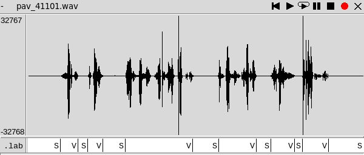
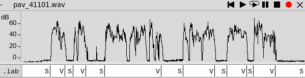
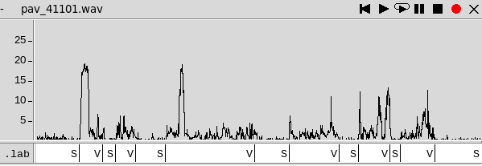
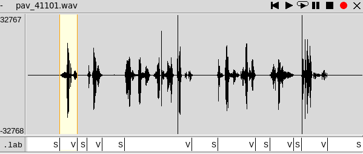

PAV - P2: detección de actividad vocal (VAD)
============================================

Esta práctica se distribuye a través del repositorio GitHub [Práctica 2](https://github.com/albino-pav/P2),
y una parte de su gestión se realizará mediante esta web de trabajo colaborativo.  Al contrario que Git,
GitHub se gestiona completamente desde un entorno gráfico bastante intuitivo. Además, está razonablemente
documentado, tanto internamente, mediante sus [Guías de GitHub](https://guides.github.com/), como
externamente, mediante infinidad de tutoriales, guías y vídeos disponibles gratuitamente en internet.


Inicialización del repositorio de la práctica.
----------------------------------------------

Para cargar los ficheros en su ordenador personal debe seguir los pasos siguientes:

*	Abra una cuenta GitHub para gestionar esta y el resto de prácticas del curso.
*	Cree un repositorio GitHub con el contenido inicial de la práctica (sólo debe hacerlo uno de los
	integrantes del grupo de laboratorio, cuya página GitHub actuará de repositorio central del grupo):
	-	Acceda la página de la [Práctica 2](https://github.com/albino-pav/P2).
	-	En la parte superior derecha encontrará el botón **`Fork`**. Apriételo y, después de unos segundos,
		se creará en su cuenta GitHub un proyecto con el mismo nombre (**P2**). Si ya tuviera uno con ese 
		nombre, se utilizará el nombre **P2-1**, y así sucesivamente.
*	Habilite al resto de miembros del grupo como *colaboradores* del proyecto; de este modo, podrán
	subir sus modificaciones al repositorio central:
	-	En la página principal del repositorio, en la pestaña **:gear:`Settings`**, escoja la opción 
		**Collaborators** y añada a su compañero de prácticas.
	-	Éste recibirá un email solicitándole confirmación. Una vez confirmado, tanto él como el
		propietario podrán gestionar el repositorio, por ejemplo: crear ramas en él o subir las
		modificaciones de su directorio local de trabajo al repositorio GitHub.
*	En la página principal del repositorio, localice el botón **Branch: master** y úselo para crear
	una rama nueva con los primeros apellidos de los integrantes del equipo de prácticas separados por
	guion (**fulano-mengano**).
*	Todos los miembros del grupo deben realizar su copia local en su ordenador personal.
	-	Copie la dirección de su copia del repositorio apretando en el botón **Clone or download**.
		Asegúrese de usar *Clone with HTTPS*.
	-	Abra una sesión de Bash en su ordenador personal y vaya al directorio **PAV**. Desde ahí, ejecute:

		```.sh
		git clone dirección-del-fork-de-la-práctica
		```

	-	Vaya al directorio de la práctica `cd P2`.
	-	Añada la etiqueta `origin` a su copia del repositorio. Esto es útil para facilitar los *push* y
		*pull* al repositorio original:
		```.sh
		git remote add origin dirección-del-fork-de-la-práctica
		```
	-	Cambie a la rama **fulano-mengano** con la orden:

		```.sh
		git checkout fulano-mengano
		```

*	A partir de este momento, todos los miembros del grupo de prácticas pueden trabajar en su directorio
	local del modo habitual.
	-	También puede utilizar el repositorio remoto como repositorio central para el trabajo colaborativo
		de los distintos miembros del grupo de prácticas; o puede serle útil usarlo como copia de
		seguridad.
	-	Cada vez que quiera subir sus cambios locales al repositorio GitHub deberá confirmar los
		cambios en su directorio local:

		```.sh
		git add .
		git commit -m "Mensaje del commit"
		```

		y, a continuación, subirlos con la orden:

		```.sh
		git push -u origin fulano-mengano
		```

*	Al final de la práctica, la rama **fulano-mengano** del repositorio GitHub servirá para remitir la
	práctica para su evaluación utilizando el mecanismo *pull request*.
	-	Vaya a la página principal de la copia del repositorio y asegúrese de estar en la rama
		**fulano-mengano**.
	-	Pulse en el botón **New pull request**, y siga las instrucciones de GitHub.


Entrega de la práctica.
-----------------------

Responda, en este mismo documento (README.md), los ejercicios indicados a continuación. Este documento es
un fichero de texto escrito con un formato denominado _**markdown**_. La principal característica de este
formato es que, manteniendo la legibilidad cuando se visualiza con herramientas en modo texto (`more`,
`less`, editores varios, ...), permite amplias posibilidades de visualización con formato en una amplia
gama de aplicaciones; muy notablemente, **GitHub**, **Doxygen** y **Facebook** (ciertamente, :eyes:).

En GitHub. cuando existe un fichero denominado README.md en el directorio raíz de un repositorio, se
interpreta y muestra al entrar en el repositorio.

Debe redactar las respuestas a los ejercicios usando Markdown. Puede encontrar información acerca de su
sintáxis en la página web [Sintaxis de Markdown](https://daringfireball.net/projects/markdown/syntax).
También puede consultar el documento adjunto [MARKDOWN.md](MARKDOWN.md), en el que se enumeran los
elementos más relevantes para completar la redacción de esta práctica.

Recuerde realizar el *pull request* una vez completada la práctica.

Ejercicios
----------

### Etiquetado manual de los segmentos de voz y silencio

- Etiquete manualmente los segmentos de voz y silencio del fichero grabado al efecto. Inserte, a 
  continuación, una captura de `wavesurfer` en la que se vea con claridad la señal temporal, el contorno de
  potencia y la tasa de cruces por cero, junto con el etiquetado manual de los segmentos.

	Para una mayor precisión, reutilizando los ficheros y el programa *p1* empleado en la práctica 1, hacemos una copia de la grabación .wav con el nuevo nombre *pav_41101.wav* y generamos distintos ficheros con los datos de análisis de la potencia, amplitud y tasa de curces por cero.

	***~/PAV/P1$ p1 pav_41101.wav | cut -f2 > pav_41101.pot***

	***~/PAV/P1$ p1 pav_41101.wav | cut -f3 > pav_41101.amp***

	***~/PAV/P1$ p1 pav_41101.wav | cut -f4 > pav_41101.zcr***

	A continuación, guardamos los ficheros creados en nuestro nuevo directorio de trabajo (/PAV/P2) y ejecutamos el programa wavesurfer para representar las gráficas.

	***~/PAV/P2$ wavesurfer pav_41101.wav***

	Seleccionamos **Create Pane** -> **Data Plot** y, desde el panel creado, **Open Data File** abrimos nuestros ficheros de datos.

	Para la creación de etiquetas, hemos creado un panel *transcription* y hemos asignado a los diferentes segmentos de silencio la etiqueta **(S)** y para los de voz la etiqueta **(V)**. Además, solo hemos considerando como validas aquellas que se perciban claramente (no pausas cortas ni picos aislados).

	El resultado son las siguientes gráficas para la señal temporal, el contorno de potencia y la tasa de cruces por cero, respectivamente:

	<kbd></kbd>

	<kbd></kbd>

	<kbd></kbd>	

- A la vista de la gráfica, indique qué valores considera adecuados para las magnitudes siguientes:

	* Incremento del nivel potencia en dB, respecto al nivel correspondiente al silencio inicial, para
	  estar seguros de que un segmento de señal se corresponde con voz.

	En potencia, al inicio tenemos un valor medio de ruido inicial de **-8.5 dB**, cuando se estabiliza la señal tenemos un silencio medio de **-4.5 dB** y de señal de voz un valor medio de **45 dB**.
	Por lo tanto, el incremento medio de potencia entre el ruido inicial y el silencio es de ***4 dB***, y el incremento medio de potencia entre el silencio y la señal de voz es ***49.5 dB***.

	No obstante, para tener una cierta certesa que se trata de un tramo de voz el valor mínimo de incremento que podemos considerar es respecto a los fonemas de las consonantes sonoras, de esta manera cualquier incremento superior a este se tratará de una señal de voz.

	En nuestro caso, las consonantes sonoras tienen un valor medio de potencia de **0.5 dB**, por lo tanto el incremento de nivel de potencia mínimo es ***5 dB***.

	* Duración mínima razonable de los segmentos de voz y silencio.

	Las duraciones mínimas corresponden a los segmentos más pequeños de voz y silencio.

	<kbd></kbd>

	<kbd></kbd>

	
	Tal como se puede ver en las gráficas de nuestra señal estos valores corresponden a la primera etiqueta de voz y a la penúltima de silencio.

	Para calcular estas duraciones ejecutamos el siguiente comando para visualizar los limites de cada etiqueta:

	***~/PAV/P2$ cat pav_41101.lab***

	<kbd></kbd>	

	Por lo tanto, los tiempos mínimos requeridos son
	**Tv = 0.684 s** y **Ts = 0.306 s**

	No obstante, también existen pequeñas pausas al hablar que determinan si hemos acabado de hablar. Podemos considerar estas como ***Tpause = 0.05 s***.

	* ¿Es capaz de sacar alguna conclusión a partir de la evolución de la tasa de cruces por cero?

	Se puede observar con diferencia como aquellos picos del zcr corresponden a los sonidos sordos del habla, mientras que los sonidos sonoros tienen menor amplitud de zcr.

### Desarrollo del detector de actividad vocal

- Complete el código de los ficheros de la práctica para implementar un detector de actividad vocal tan
  exacto como sea posible. Tome como objetivo la maximización de la puntuación-F `TOTAL`.

	Hemos recuperado los ficheros *pav_analysis.c* y *pav_analysis.h* (para el computo de potencia) y los hemos copiado en nuestro directorio *src*.

	Además, hemos creado el fichero ***meson.build*** de la siguiente manera:
	- En la primera línea el nombre de nuestro proyecto.
	- En las siguientes líneas las variables y elementos principales de nuestro programa:
		+ Nombre del programa: *vad*
		+ Códigos fuentes: *main_vad.c*, *vad.c* y *pav_analysis.c*
		+ Librerías útiles: *m* y *sndfile*
	
	El resultado es el siguiente:

	<kbd></kbd>

	Una vez creado, ejecutamos meson y ninja para generar el programa en el directorio bin.

	***~/PAV/P2$ meson bin***

	***~/PAV/P2$ ninja -C bin***

	A continuación, hemos completado el código de los ficheros *vad.h*, *vad.c* y *main_vad.c* completando las secciones comentadas por TODO y siguiendo las instrucciones del manual de prácticas.

	###### Todos los ficheros código están comentados paso a paso

	#### VAD.H

	Hemos añadido dos estados internos para los estados indefinidos
	- *ST_MAYBESILENCE*: Cuando el estado actual es Voz y el valor de potencia disminuye por debajo del umbral.
	- *ST_MAYBEVOICE*: Análogamente, cuando el estado actual es Silencio y el valor de potencia supera el umbral.

	Hemos definido nuevas variables
	Para los umbrales,
	- *k0*: Umbral de referencia inicial
	- *k1*: Umbral de referencia silencio
	- *k2*: Umbral de referencia señal de voz

	<kbd></kbd>

	También, hemos creado la variable *frame* que indica el número de trama leída y que nos servirá para el cómputo del valor de potencia medio inicial (k0).

	#### VAD.C

	Hemos definido nuevas constantes
	- *DIF_dB_SILENCE*: Incremento mínimo entre la señal de voz y el silencio que obtuvimos en el ejercicio anterior en dB.
	- *PAUSES*: Duración miníma de una pausa al hablar en ms.
	- *FM*: Frecuencia de muestreo de la señal de entrada .wav  en Hz.

	Inicializamos todas las variables nuevas a 0 y creamos un objeto potencia llamado *p* a partir del cálculo de la potencia media del fichero *pav_analysis.c*. Este objeto tomará cada muestra de nuestro fichero de audio e irá calculando su potencia.

	Para la relación entre estados de la función *vad()* hemos seguido el siguiente esquema:

	<kbd></kbd>

	- *ST_INIT*: 
	Calculamos el umbral k0 a partir de la media de las primeras muestras hasta superar el incremento de potencia mínimo entre el ruido y el silencio.
	A partir de aquí, consideramos el estado *ST_SILENCE*.
	
	Calculamos el umbral k1 como el resultado de restar el valor de potencia actaul -2dB, ya que el margen de silencio oscila unos 4dB y no sabemos con exactitud si la muestra actual es el valor medio de silencio. Por otro lado, calculamos k2 como el resultado de sumar a k1 5dB. De esta manera, estamos seguros que no estamos en silencio sino en voz.

	- *ST_SILENCE*:
	Si el valor de potencia actual es mayor que el umbral de silencio, pasamos al estado indefinido *ST_MAYBEVOICE*.

	- *ST_VOICE*:
	Si el valor de potencia actual está por debajo del umbral de voz, pasamos al estado indefinido *ST_MAYBESILENCE*.

	- *ST_MAYBESILENCE*:
	Actualizamos el tiempo que estamos en este estado y si el valor de potencia actual es menor al umbral de voz y ha transcurrido un tiempo mayor a una pausa pasamos al estado *ST_VOICE*.
	No obstante, si el valor de potencia es menor al umbral de silencio pasamos a *ST_SILENCE*.

	- *ST_MAYBEVOICE*:
	Análogo.

	#### MAIN_VAD.C

	En este fichero, decimos que etiqueta se imprimirá según el estado.
	Para los casos indefinidos *ST_MAYBESILENCE* y *ST_MAYBEVOICE* la decisión se realizará a partir del estado anterior. Es decir, si el estado actual es "ST_UNDEF" y el anterior era "ST_VOICE" se decidirá este último y analógo para *ST_SILENCE*.

	Compilamos y ejecutamos el siguiente comando ejecutar nuestro programa vad con nuestro archivo de audio:

	***~/PAV/P2$ bin/vad -i pav_41101.wav -o pav_41101.vad***

	A continuación realizamos el alineado entre el resultado y la referencia, y calculamos las tasas:

	***~/PAV/P2$ scripts/vad_evaluation.pl pav_41101.lab***

	El resultado es el siguiente:

	<kbd></kbd>

	Como podemos ver las tasas para las tramas de silencio son buenas. No obstante, para el silencio disminuyen sobretodo para el F-score. Este problema alomejor se debe a la potencia de los instantes iniciales de nuestra señal de audio (próximas a 0), ya que el silencio y el umbral k0 lo determinan estas muestras.


- Explique, si existen. las discrepancias entre el etiquetado manual y la detección automática.

	Realizamos una comparación de los ficheros .lab y .vad en el wavesurfer y obtenemos el siguiente resultado:

	<kbd></kbd>

	Como podemos ver, para los segmentos de voz las etiquetas de la detección automática están bien ubicadas, no obstante, para los segmentos de silencio observamos etiquetas de voz y silencio alternadas.
	Esto se debe a lo explicado anteriormente con el valor promedio de las primeras muestras de potencia *k0* para nuestro archivo de audio.

- Evalúe los resultados sobre la base de datos `db.v4` con el script `vad_evaluation.pl` e inserte a 
  continuación las tasas de sensibilidad (*recall*) y precisión para el conjunto de la base de datos (sólo
  el resumen).

  <kbd></kbd>

  En este caso, nuestro programa obtiene mejores resultados a partir de los ficheros .wav y sus referencias almacenados en *db.v4*.
  

### Trabajos de ampliación

#### Cancelación del ruido en los segmentos de silencio

- Si ha desarrollado el algoritmo para la cancelación de los segmentos de silencio, inserte una gráfica en
  la que se vea con claridad la señal antes y después de la cancelación (puede que `wavesurfer` no sea la
  mejor opción para esto, ya que no es capaz de visualizar varias señales al mismo tiempo).

#### Gestión de las opciones del programa usando `docopt_c`

- Si ha usado `docopt_c` para realizar la gestión de las opciones y argumentos del programa `vad`, inserte
  una captura de pantalla en la que se vea el mensaje de ayuda del programa.


### Contribuciones adicionales y/o comentarios acerca de la práctica

- Indique a continuación si ha realizado algún tipo de aportación suplementaria (algoritmos de detección o 
  parámetros alternativos, etc.).

- Si lo desea, puede realizar también algún comentario acerca de la realización de la práctica que
  considere de interés de cara a su evaluación.


### Antes de entregar la práctica

Recuerde comprobar que el repositorio cuenta con los códigos correctos y en condiciones de ser 
correctamente compilados con la orden `meson bin; ninja -C bin`. El programa generado (`bin/vad`) será
el usado, sin más opciones, para realizar la evaluación *ciega* del sistema.
